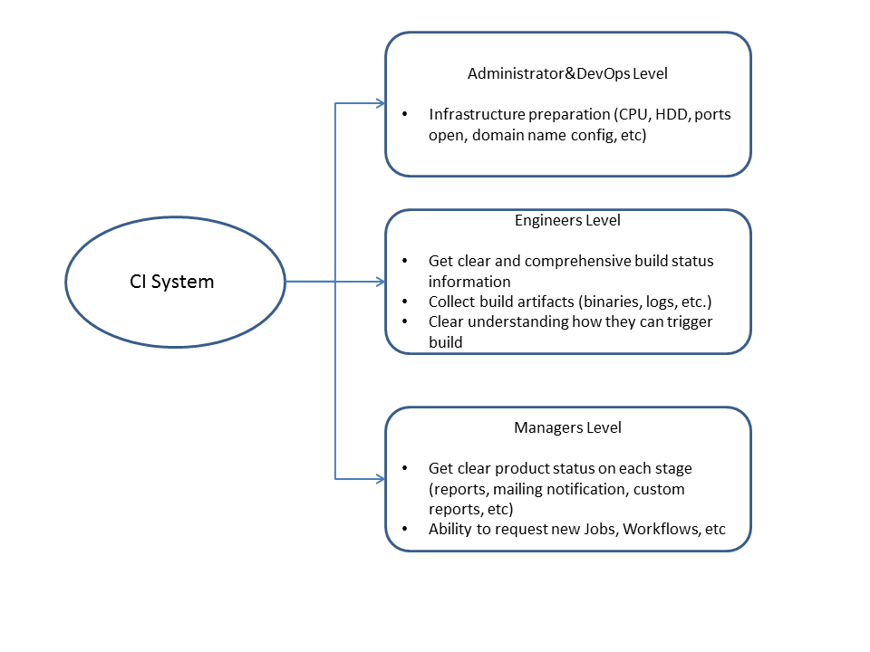
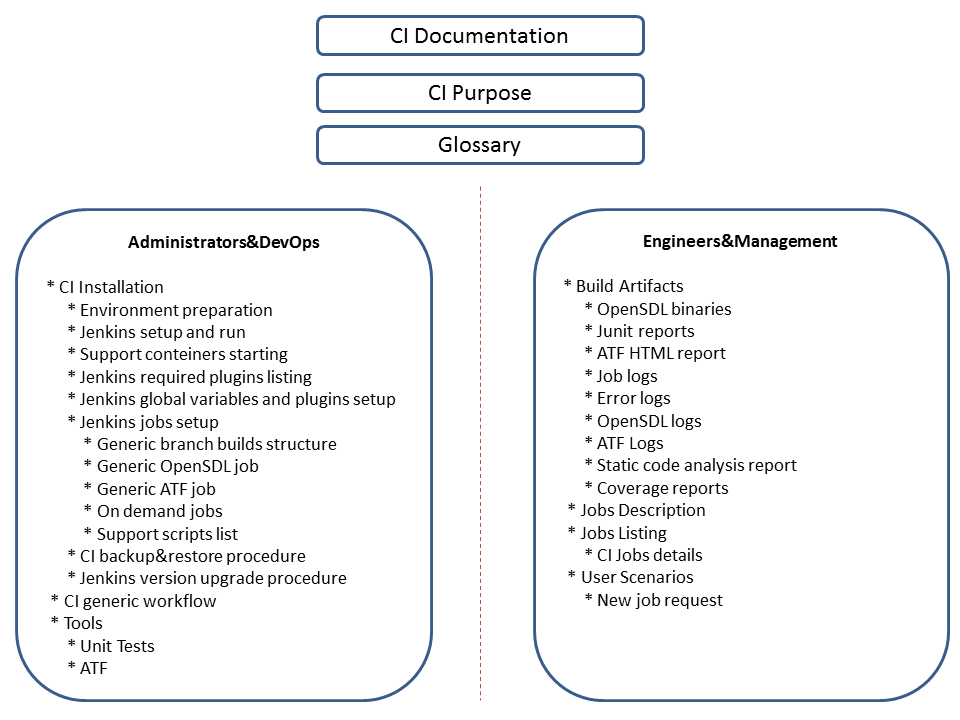

# Continious Integration documentation update

* Proposal: [SDL-NNNN](NNNN-ci_documentation_update.md)
* Author: [Alexander Vasilyev](https://github.com/ovvasyliev)
* Status: **Awaiting review**
* Impacted Platforms: [CI]

## Introduction

Software development requiers fast and bugs free code creation. It can be achived only by using of Continious Integration system which guarantee the same workflow and build environment for every build from every developer. It gets even more valuable in open source projects - every contributor must be sure his commit will not broke entire product. OpenSDL project using Continious Integration system based on Jenkins. CI allows to execute builds in fast and simultaneous environment. And to perform all required checks on every pull request, commit to a branch, etc, provide clear and visible status reports. 
Each system should be supported and keeping in working condition. To make support proccess easier - documentation should be created. At this point our CI is fully functional. But efficient using of this system requieres some expirience and knowledge. 
At high level we can describe three levels of system usage and corresponding areas which should be covered with Documentation:

## Motivation

Most common problem for complicated systems is missconfiguration in case of disaster recovery process. Also major problem is lost knowledge - if system working fine for descent amount of time, maintainer can lost some specific steps of it's configuration. Full and comprehencive documentation solves these problems. As well as CI maintainer change problem. All knowledge stored in one place and everyone can setup own and/or maintain existing system.
CI docmentation will reduce time for infrastructure preparation for administrators, and initial configuration time for DevOps. Change management for CI system also will be easier if some additional jobs/branches/configurations should be modified. 
OEM manufacturers engineers will have ability to get all required knowledge to work with CI in one place. It will simplify learning curve and increase efficency of system usage.

## Proposed solution

Create full and comprehencive documentation for existing CI system. Table of content can be found below.

For efficient maintain of CI system - separate GitHub repository should be created. It will hold all documentation, configurations, support scripts etc.
Any issue or proposal regarding this documentation should be proposed via GitHub issues in CI repository. Documentation maintenance will be executed in scope of CI system SLA.

Well written documentation will reduce risks in maintainance and deployment of CI system. Also it will allow to understand internall processes and build workflows for all community members and contributors. Contributors will faster get information where to find results of their pull requests. Good documentation can lead to improvement of existing CI system by cler descriptions of it's structure and potential weak places.

## Potential downsides

No major downsides for this activity. Except of one - this documentation will be platform dependent for some steps. And this piont should be taken in consideration if similar system should be required to be deployed somwhere else.

## Impact on existing code

No impact for existing code.

## Alternatives considered

As alternate approach - some of cloud CI system can be used (i.e. TravisCI). But this is not valid approach due to lack of configuration options and low flexibility of this systems.  
